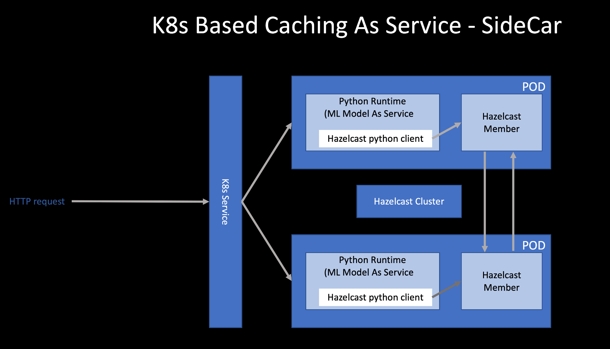

## Kubernetes Based Caching As Service Powered by Hazelcast


## Steps

- Create Role Based Access Control
```bash
kubectl apply -f operator-rbac.yaml
```
NOTE: to add cluster permission

```bash
kubectl apply -f hazelcast-rbac.yaml
```

- Create Custom Resource Definition
```bash
kubectl apply -f hazelcast-cluster.crd.yaml
```
- Hazelcast operator deployment
```bash
kubectl --validate=false apply -f hazelcast-operator.yaml
```

- Finally, start Hazelcast cluster as sidecar

```bash
kubectl apply -f hazelcast.yaml
```

## Deployment Patterns

- SideCar
 

- ..